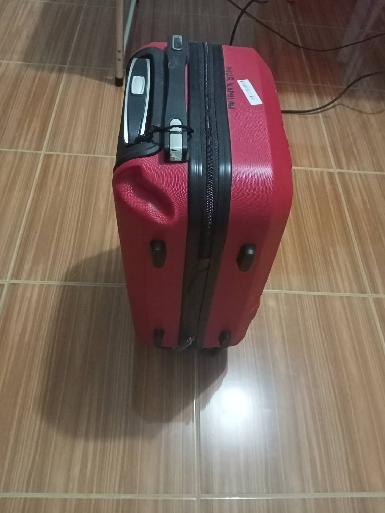
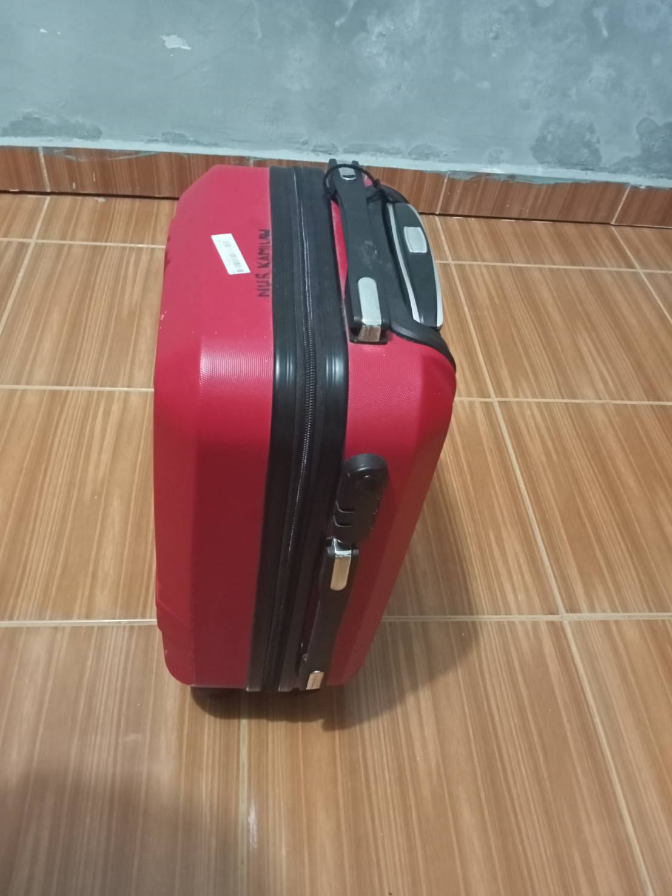
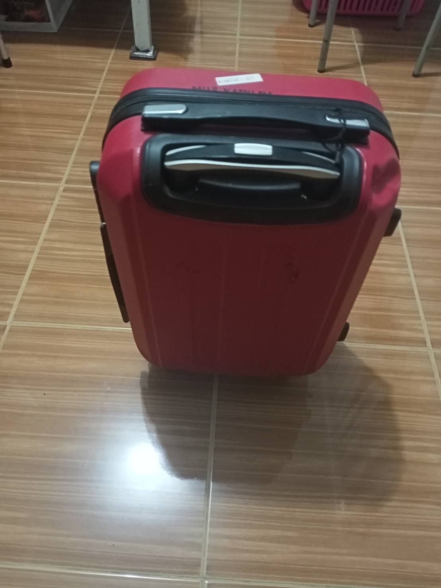
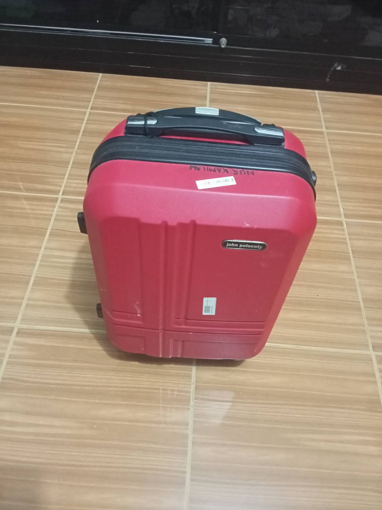
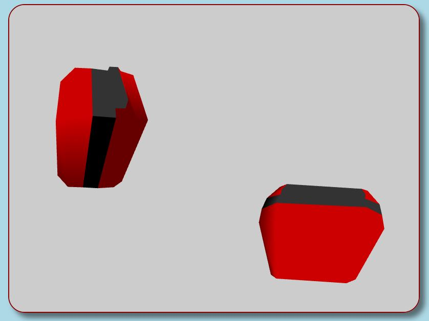
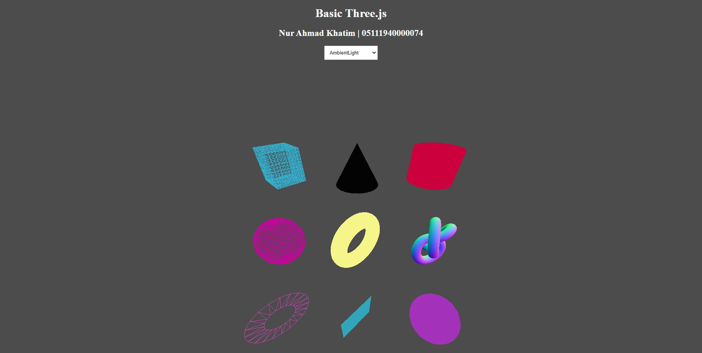
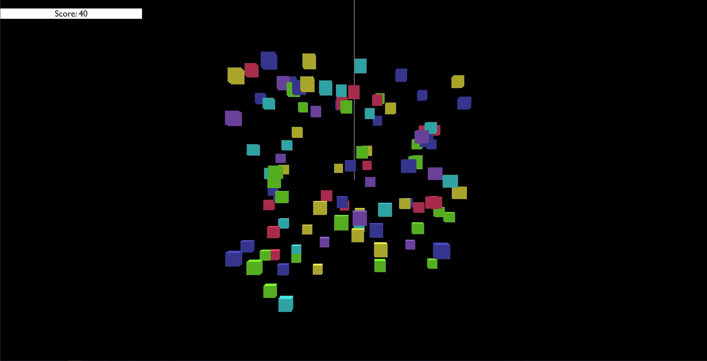

# Tugas 1

## Nur Ahmad Khatim
## 05111940000074
### Nama Benda : Koper
### Foto dari sudut kanan atas :

### Foto dari sudut kiri atas :

### Foto dari sudut belakang atas :

### Foto dari sudut depan atas :

### Preview Web-GL : <a href="https://cg2021a.github.io/tugas-1-naimackerman/tugas-1-webgl">Tugas-1-WebGL</a>

 

### Preview Three-JS : <a href="https://cg2021a.github.io/tugas-1-naimackerman/tugas-1-threejs">Tugas-1-ThreeJS</a>

### Preview User Interaction Three-JS : <a href="https://cg2021a.github.io/tugas-1-naimackerman/tugas-individu-threejs">Tugas-Individu-ThreeJS</a>
